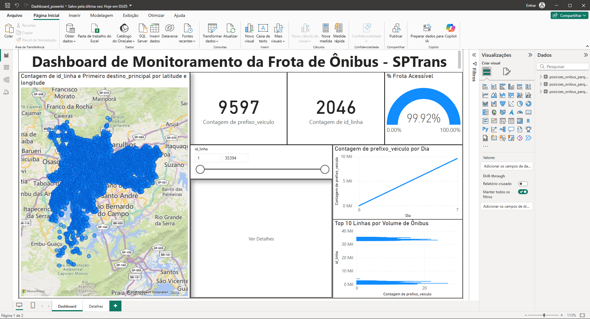
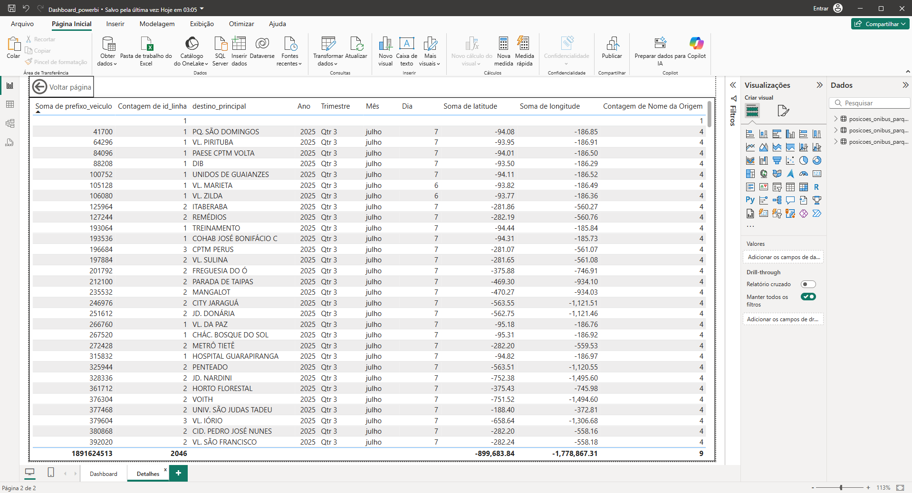

[🇧🇷 Ver em Português](./README.pt-br.md)
---
# Real-Time Bus Fleet Data Pipeline


---




This project implements a complete, end-to-end data engineering pipeline that captures real-time public transportation data from São Paulo, Brazil, processes it with Spark, stores it in a local data lake, and orchestrates the entire workflow with Airflow.

## 🏛️ Architecture

The pipeline is designed to be a scalable and robust platform for handling real-time data streams. The data flows through several stages, from ingestion to storage and visualization.

**Data Flow:**
1.  **Ingestion:** A Python script (`producer.py`) calls the official [SPTrans Olho Vivo API](https://www.sptrans.com.br/desenvolvedores/) to fetch real-time bus location data.
2.  **Messaging Queue:** The collected data is published as messages to an Kafka topic, creating a durable and scalable data stream.
3.  **Stream Processing:** An Spark Structured Streaming job consumes the data from the Kafka topic in real-time. It applies transformations, cleans the data, and converts data types.
4.  **Data Lake Storage:** The processed data is written to a local Data Lake in the highly efficient, columnar Parquet format.
5.  **Orchestration:** The entire workflow is scheduled, monitored, and automated by Apache Airflow, ensuring that the tasks run in the correct order and handling failures gracefully.
6.  **BI & Analysis:** The final data stored in the Parquet files is connected to Power BI for creating interactive dashboards and to Jupyter Notebooks for in-depth analysis using Spark SQL.

## 🛠️ Technologies Used

- **Data Ingestion:** Python (`requests`), Apache Kafka
- **Data Processing:** Apache Spark (PySpark)
- **Data Storage:** Parquet (Data Lake)
- **Orchestration:** Apache Airflow
- **Containerization:** Docker & Docker Compose
- **BI & Visualization:** Power BI
- **Analysis:** Jupyter Notebook, Spark SQL
- **Environment:** Python 3.11, Java 17

## 🚀 Setup and Execution

Follow these steps to run the entire pipeline on your local machine.

### Prerequisites
- Docker & Docker Compose
- Python 3.11
- An API Token from [SPTrans Olho Vivo](https://www.sptrans.com.br/desenvolvedores/).

### Steps
1.  **Clone the repository:**
    ```bash
    git clone [https://github.com/](https://github.com/)[SEU_USUARIO]/[SEU_REPOSITORIO].git
    cd [SEU_REPOSITORIO]
    ```

2.  **Create and activate the virtual environment:**
    ```bash
    python3.11 -m venv .venv
    source .venv/bin/activate
    ```

3.  **Install Python dependencies:**
    ```bash
    pip install -r requirements.txt
    ```

4.  **Set the API Token:**
    *(This token is required to run the real-time producer or the sample data collector)*.
    ```bash
    export SPTRANS_API_TOKEN='YOUR_SPTRANS_TOKEN_HERE'
    ```
    
5.  **Start the Infrastructure:**
    This command will start the Kafka and Zookeeper containers in the background.
    ```bash
    docker-compose up -d
    ```

6.  **Initialize and Run Airflow:**
    * **Set Airflow Home:**
        ```bash
        export AIRFLOW_HOME=$(pwd)/airflow
        ```
    * **Initialize the Database:**
        ```bash
        airflow db init
        ```
    * **Create an Admin User:**
        ```bash
        airflow users create \
            --username admin \
            --firstname YourFirstName \
            --lastname YourLastName \
            --role Admin \
            --email your.email@example.com \
            --password yourpassword
        ```
    * **Start the Webserver and Scheduler (in two separate terminals):**
        ```bash
        # Terminal 1
        airflow webserver
        
        # Terminal 2
        airflow scheduler
        ```

7.  **Run the Pipeline:**
    * Access the Airflow UI at `http://localhost:8080`.
    * Log in with the credentials you just created.
    * Find the `sptrans_data_pipeline` DAG, un-pause it using the toggle, and trigger it using the play button.

## 📊 Dashboard & Analysis

The final output of this pipeline is a data lake of Parquet files, which can be used for analysis.

### Power BI Dashboard
A Power BI report was created to visualize the collected data, showing KPIs, bus locations on a map, and activity trends over time.


### SQL Analysis
The data can also be queried interactively using Spark SQL in a Jupyter Notebook, located in the `/notebooks` folder.

## 🔧 Challenges & Learnings

Building this end-to-end pipeline involved overcoming several real-world data engineering challenges:

-   **Environment Hell:** The project started with major compatibility issues between Spark 4.0, its connectors, and the underlying Java version. This was solved by downgrading to the stable Spark 3.5.1 and Python 3.11, creating a clean, reproducible environment.
-   **Dependency Conflicts:** The connectors for cloud services like BigQuery and Delta Lake presented deep dependency conflicts (`NoSuchMethodError`, `ClassNotFoundException`). This led to a strategic pivot to a more robust, dependency-isolated solution (saving to native Parquet).
-   **Network/Firewall Issues:** The `spark-submit --packages` command consistently failed to download dependencies due to a local network issue, reinforcing the decision to pivot to a solution with fewer external downloads.
-   **Orchestration Nuances:** Implementing the pipeline in Airflow revealed classic orchestration problems, such as race conditions (the Spark consumer starting before the Kafka topic was created) and handling shell command exit codes (`gtimeout` on macOS). These were solved by adding wait tasks and error-handling logic to the DAG.

## Improvements for the Future

-   Deploy the entire stack to a cloud provider (GCP or AWS).
-   Use a managed Kafka service (like Confluent Cloud) instead of a local container.
-   Replace the Parquet data lake with a managed Data Warehouse like BigQuery or Snowflake once network issues are resolved.
-   Create more complex BI dashboards and automated alerts.

## 👤 Author

**Vinicius Moreira**

-   [LinkedIn](https://www.linkedin.com/in/vinicius-moreira-806105350)
-   [GitHub](https://github.com/Viniciuss-Moreira)
